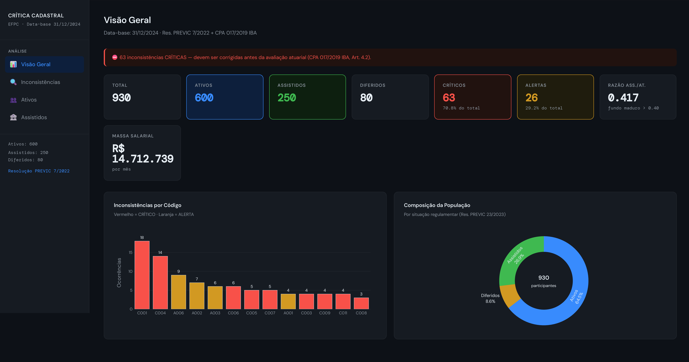
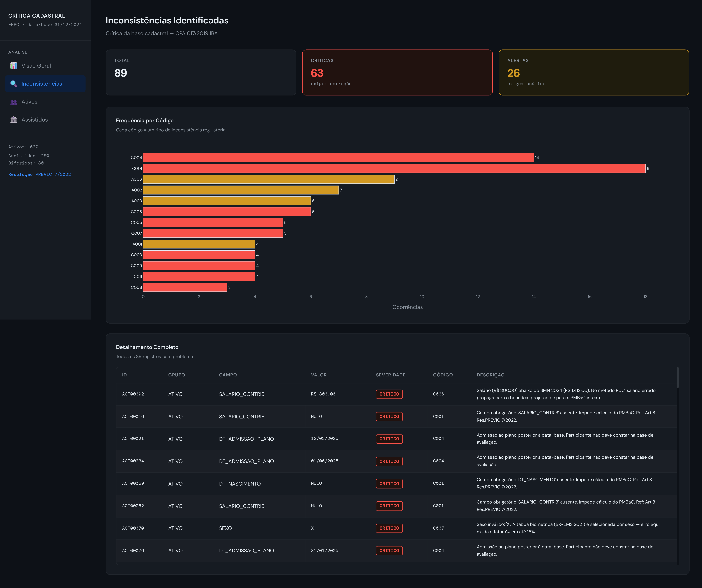
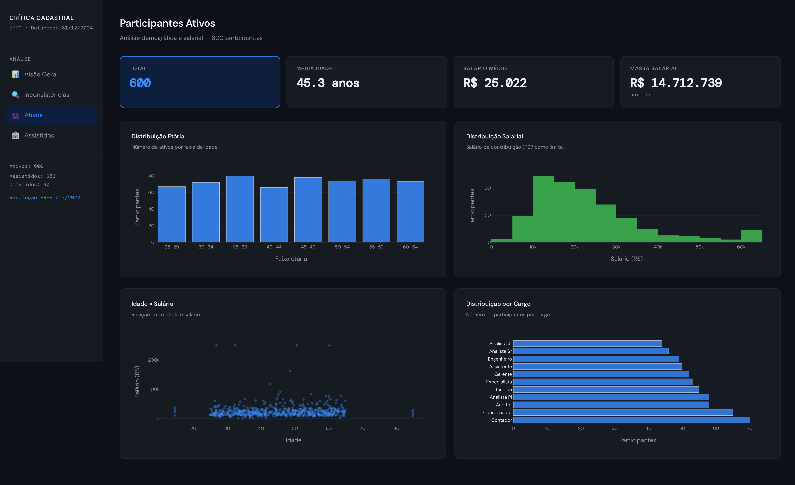
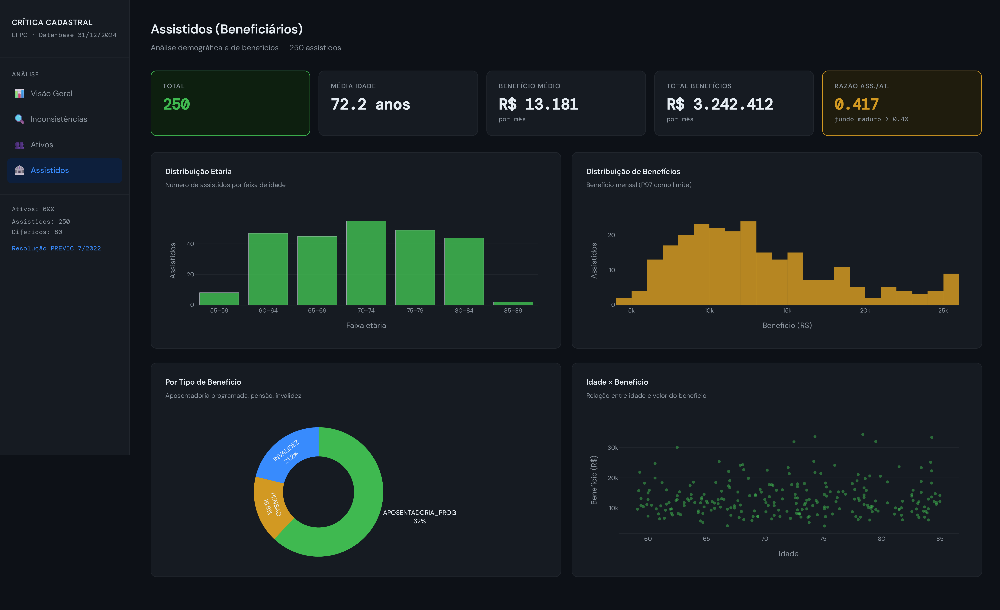

# Crítica da Base Cadastral — Avaliação Atuarial EFPC

Pipeline Python de validação e crítica de bases cadastrais de fundos de pensão (EFPC), conforme exigências da PREVIC e do Instituto Brasileiro de Atuária. O sistema automatiza em aproximadamente dois segundos um processo que tipicamente ocupa horas de trabalho manual em Excel, gerando relatório atuarial formatado, dados para Power BI e um dashboard interativo via Plotly Dash ou Power BI Desktop.



---

## Por que este projeto existe

A **Resolução PREVIC nº 7/2022, Art. 8** determina que toda EFPC mantenha seus dados cadastrais em planilha eletrônica antes de cada avaliação atuarial anual. O **CPA 017/2019 do IBA** define que a crítica da base cadastral é o primeiro passo obrigatório de toda auditoria atuarial:

> "O Atuário Independente deve verificar se as informações sobre os participantes e assistidos estão alinhadas com os registros internos e os dados utilizados pelo Atuário Responsável Técnico."

Na prática esse processo é feito manualmente, campo a campo, em planilhas Excel. O atuário verifica datas de nascimento inválidas, salários abaixo do SMN, CPFs duplicados, admissões posteriores à data-base e dezenas de outros critérios — muitos deles definidos na tábua biométrica AT-2000 ou BR-EMS 2021, cuja escolha depende do sexo do participante.

Este pipeline automatiza as 19 verificações regulatórias em uma passagem única sobre os dados, classifica cada problema como CRÍTICO (impede o cálculo das provisões matemáticas) ou ALERTA (exige análise mas não bloqueia), e entrega os resultados em múltiplos formatos para diferentes perfis de usuário na EFPC.

---

## Arquitetura do pipeline

O fluxo começa em qualquer planilha do RH e termina em relatórios atuariais, dashboards e um projeto Power BI completamente funcional, tudo gerado por código, sem interação humana.

```
Base cadastral do RH (Excel)
        │
        ▼
   pipeline.py          ← entrada via CLI ou função Python
        │
   validator.py         ← 19 verificações regulatórias
        │
        ▼
   report_generator.py  ← monta os 7 arquivos de saída
        │
   ┌────┴────────────────────────────┐
   ▼                                 ▼
relatorio_critica_cadastral.xlsx    powerbi_data.xlsx (7 abas)
(relatório atuarial, 4 abas)              │
                                          ▼
                                   powerbi_generator.py
                                          │
                                   ┌──────┴──────┐
                                   ▼              ▼
                            PBIP/PBIR project  dashboard.py
                            (Power BI Desktop)  (Plotly Dash 4)
```

---

## Stack tecnológico

| Camada | Tecnologia | Uso |
|---|---|---|
| Validação e relatório | Python 3.11 · pandas · openpyxl | Pipeline CLI, 19 verificações, Excels formatados |
| Dashboard interativo | Plotly Dash 4 · Flask · gunicorn | 4 páginas, tema dark, roteamento via dcc.Location |
| Deploy empresarial | Docker · docker-compose | Self-hosted, dados permanecem na rede interna |
| BI corporativo gerado por código | Power BI PBIP/PBIR · TMDL | src/powerbi_generator.py gera 47 arquivos JSON |

---

## Screenshots

**Inconsistências Identificadas** — frequência por código regulatório e tabela completa com badges CRÍTICO e ALERTA


**Participantes Ativos** — distribuição etária, salarial, scatter idade × salário e breakdown por cargo


**Assistidos (Beneficiários)** — distribuição etária, benefícios por faixa, donut por tipo e scatter idade × benefício mensal


---

## Início rápido

### Opção A — Python direto

```bash
python -m venv venv
venv\Scripts\activate        # Windows
# ou
source venv/bin/activate     # Linux/Mac

pip install -r requirements.txt

# Rodar pipeline com dados demo (930 participantes sintéticos)
python src/pipeline.py --demo

# Abrir dashboard em http://localhost:8050
python app/dashboard.py
```

### Opção B — Docker (deploy empresarial)

```bash
# Build e start
docker compose up -d --build

# Acessar em http://localhost:8050
# Na rede interna da empresa: http://IP-DO-SERVIDOR:8050

# Ver logs
docker compose logs -f

# Parar
docker compose down
```

### Opção C — Power BI gerado por código

```bash
# 1. Gerar os dados
python src/pipeline.py --demo

# 2. Gerar o projeto PBIP/PBIR completo (47 arquivos JSON)
python src/powerbi_generator.py

# 3. Habilitar PBIR no Power BI Desktop
#    File > Options > Preview features >
#    "Store reports using enhanced metadata format (PBIR)"

# 4. Abrir o projeto
#    File > Open > powerbi/report/CriticaCadastral.pbip
```

---

## Saídas geradas

Após `python src/pipeline.py --demo` a pasta `results/reports/` conterá:

**`relatorio_critica_cadastral.xlsx`** — relatório para o atuário responsável, com quatro abas:

- `Sumário` — KPIs gerais, data-base, razão assistidos/ativos, massa salarial total
- `CRITICAS` — registros que impedem o cálculo de PMBaC/PMBC, com descrição regulatória completa
- `ALERTAS` — registros que exigem análise antes da avaliação
- `Populacao_OK` — participantes sem inconsistências, prontos para o modelo atuarial

**`powerbi_data.xlsx`** — 7 abas estruturadas para importação no Power BI:

- `POP_ATIVOS`, `POP_ASSISTIDOS`, `POP_DIFERIDOS` — dados populacionais enriquecidos com faixas etárias
- `POPULACAO_TOTAL` — visão consolidada dos três grupos para gráficos de composição
- `INCONSISTENCIAS` — todas as inconsistências com campos, valores, severidade e descrição regulatória
- `FREQ_INCONSISTENCIAS` — frequência por código, com percentual do total
- `SUMARIO_KPI` — linha única com todos os indicadores em formato wide para cards no Power BI

---

## Dashboard Plotly Dash

O dashboard roda em `http://localhost:8050` e tem quatro páginas navegáveis via sidebar:

**Visão Geral** exibe os seis KPIs principais (total de participantes por situação regulamentar, inconsistências críticas e alertas), o gráfico de inconsistências por código com cores CRÍTICO/ALERTA e o donut de composição da população.

**Inconsistências Identificadas** mostra o gráfico de frequência por código, o banner com o total de críticas (em vermelho conforme CPA 017/2019) e a tabela completa dos registros problemáticos com IDs, campos, valores e descrições regulatórias, incluindo o artigo da norma infringida.

**Participantes Ativos** traz a distribuição etária por faixa (com visibilidade de participantes sem DT_NASCIMENTO — estes são as próprias inconsistências C001, mantidos intencionalmente no gráfico), a distribuição salarial, o scatter idade × salário e o ranking de cargos.

**Assistidos (Beneficiários)** exibe a distribuição etária, o benefício médio por faixa etária, o donut por tipo de benefício (aposentadoria programada, invalidez, pensão) e o scatter idade × benefício mensal.

---

## Power BI — gerado completamente por código

### Como funciona o gerador PBIP/PBIR

O arquivo `src/powerbi_generator.py` cria um projeto Power BI completo a partir do `powerbi_data.xlsx` sem abrir o Power BI Desktop. O resultado são 47 arquivos organizados na estrutura oficial da Microsoft:

```
powerbi/report/
├── CriticaCadastral.pbip
├── CriticaCadastral.SemanticModel/
│   ├── .platform                          ← identifica o item para o Fabric
│   ├── definition.pbism
│   ├── diagramLayout.json
│   └── definition/
│       ├── model.tmdl                     ← modelo semântico como texto (TMDL)
│       ├── database.tmdl
│       ├── cultures/pt-BR.tmdl
│       └── tables/
│           ├── POP_ATIVOS.tmdl
│           ├── POP_ASSISTIDOS.tmdl
│           ├── POP_DIFERIDOS.tmdl
│           ├── POPULACAO_TOTAL.tmdl
│           ├── INCONSISTENCIAS.tmdl
│           ├── FREQ_INCONSISTENCIAS.tmdl
│           └── SUMARIO_KPI.tmdl           ← TransformColumnTypes para tipos numéricos
└── CriticaCadastral.Report/
    ├── .platform                          ← identifica o item como Report
    ├── definition.pbir
    ├── StaticResources/SharedResources/BaseThemes/CY24SU10.json
    └── definition/
        ├── version.json
        ├── report.json
        └── pages/
            ├── pages.json
            └── <uuid>/
                ├── page.json
                └── visuals/<uuid>/visual.json  ← um arquivo por visual
```

O modelo semântico é escrito em **TMDL** (Tabular Model Definition Language), o formato texto oficial da Microsoft para versionamento de semantic models. Cada tabela tem seu próprio `.tmdl` com a query M que lê o Excel — incluindo `Table.TransformColumnTypes` para garantir que colunas numéricas sejam reconhecidas como números pelo Power Query, independente do que o Excel inferir. Isso é necessário porque o Power BI Desktop não herda automaticamente os tipos de dados de um arquivo Excel quando as colunas são lidas via `Table.PromoteHeaders`.

Cada visual é um `visual.json` com estrutura baseada no schema `visualContainer/1.3.0` e no código-fonte do `powerbpy v0.2.0`. A agregação usada nos gráficos de contagem é `Function: 5` (CountNonNull), exibida como "Count of [campo]" no Desktop. O gráfico de frequência de inconsistências usa `Function: 0` (Sum) sobre `OCORRENCIAS`, declarada como `Int64.Type` no TMDL.

Os arquivos `.platform` em cada pasta são obrigatórios a partir do Power BI Desktop April 2026 para identificar os itens como SemanticModel e Report dentro do ecossistema Fabric.

### Por que isso importa

Um arquivo `.pbix` é um ZIP binário opaco. Um `git diff` entre duas versões de um relatório `.pbix` é ilegível — o arquivo inteiro aparece como alterado. Isso torna revisão por pares, auditoria e rastreabilidade de mudanças praticamente impossíveis em contextos regulatórios onde rastreabilidade é um requisito, não uma conveniência.

O PBIP/PBIR resolve isso ao transformar o relatório em texto. Um `git diff` entre duas avaliações atuariais mostra exatamente quais visuais foram adicionados, quais métricas mudaram, quais fórmulas DAX foram alteradas — linha a linha, auditável por qualquer revisor com acesso ao repositório. Para uma EFPC sob fiscalização da PREVIC, isso é um ganho real.

---

## Plotly Dash versus Power BI: uma análise honesta

Esta é uma questão genuína e a resposta depende de quem vai usar o sistema e em que contexto.

### Plotly Dash é preferível quando

O destinatário principal é um profissional técnico — atuário, cientista de dados, analista quantitativo — que trabalha com Python e precisa de controle total sobre o que aparece na tela. Dash permite visualizações que não existem no catálogo padrão do Power BI: mapas de calor de correlação, gráficos de probabilidade, curvas de sobrevivência, plots de diagnóstico de modelos GLM. Qualquer visualização que o Plotly Express suporta está disponível com uma linha de código.

Dash também é preferível quando o pipeline de dados é Python de ponta a ponta. Os dados que alimentam os gráficos são os mesmos objetos pandas que o modelo atuarial usa — não há uma camada de transformação extra, não há uma linguagem de consulta adicional (DAX) a aprender, não há risco de divergência entre o que o modelo calcula e o que o dashboard exibe. Em atuária isso importa: o gráfico de distribuição de benefícios no Dash usa exatamente o mesmo DataFrame que calcula a provisão matemática de benefícios a conceder.

O deploy via Docker torna Dash uma escolha natural para sistemas que precisam rodar no servidor da EFPC, atrás do firewall corporativo, sem que nenhum dado de participante saia da rede interna. Power BI, mesmo com gateway on-premises, tem dependências de nuvem que podem conflitar com políticas de segurança de dados.

Por último, Dash é open source e gratuito. O código de toda a camada de visualização está no repositório, é auditável, não tem licença por usuário e não muda de comportamento quando a Microsoft lança uma atualização.

### Power BI é preferível quando

O destinatário é um profissional de negócio sem conhecimento de Python — o gerente de benefícios, o diretor financeiro do fundo, o conselheiro deliberativo — que precisa explorar os dados por conta própria usando filtros visuais, drill-down e cruzamento de dimensões sem depender do atuário para rodar um script. O Power BI foi projetado para esse perfil de usuário e é genuinamente melhor nesse cenário.

Power BI também é preferível quando a EFPC já tem licenças Microsoft 365 e Power BI Pro, e a equipe de TI já opera um gateway on-premises. Nesse caso o custo marginal de adicionar um relatório de crítica cadastral ao portfólio de relatórios existente é próximo de zero, e os gestores já sabem como usar a ferramenta.

### O que este projeto demonstra sobre as ferramentas

A decisão de implementar os dois caminhos não é redundância — é uma afirmação sobre reprodutibilidade. O dashboard Dash é o sistema operacional do atuário: rápido, preciso, controlável, versionável junto com o modelo. O projeto Power BI gerado por código é o sistema de comunicação com stakeholders: familiar para gestores, compartilhável via Power BI Service, navegável sem treinamento técnico.

O fato de o relatório Power BI ser gerado pelo mesmo pipeline que valida os dados garante consistência: não é possível ter um dashboard Dash dizendo "63 inconsistências críticas" e um relatório Power BI dizendo "60". Os dois leem o mesmo arquivo.

---

## Estado atual e perspectivas do PBIR

O **Power BI Enhanced Report Format (PBIR)** tornou-se o formato padrão para novos relatórios no Power BI Service em janeiro de 2026 e no Power BI Desktop a partir da versão de março de 2026. A Disponibilidade Geral (GA) está prevista para o terceiro trimestre de 2026, quando o formato legado deixará de ser suportado para novos desenvolvimentos.

O significado prático é que o `powerbi_generator.py` deste projeto não é um experimento — é o caminho que a Microsoft está oficialmente adotando para desenvolvimento programático de relatórios. A documentação do PBIR é pública, os schemas JSON são versionados, e a Microsoft posiciona o PBIR explicitamente como "o formato que permite a agentes de IA e scripts criar, editar e gerenciar relatórios Power BI de forma completamente suportada".

Para profissionais de ciências de dados e atuária, isso significa que a fronteira entre "escrever modelos em Python" e "construir relatórios para stakeholders no Power BI" está desaparecendo. Um pipeline como este — que vai de dados brutos do RH até um projeto Power BI funcional sem nenhum clique — é o que o ecossistema Microsoft está construindo infraestrutura para suportar em 2026.

**Fonte:** Microsoft Power BI Blog, novembro de 2025 — "PBIR will become the default Power BI Report Format" (powerbi.microsoft.com/blog). Roadmap público: Microsoft Fabric Release Plan.

---

## Validações implementadas

19 verificações cobrindo as três populações (ATIVO, ASSISTIDO, DIFERIDO):

| Código | Tipo | Campo | Norma | Descrição |
|---|---|---|---|---|
| C001 | CRÍTICO | Campos obrigatórios | Res. PREVIC 7/2022, Art. 8 | DT_NASCIMENTO, CPF, SALARIO_CONTRIB ou DT_INICIO_BENEFICIO ausentes |
| C002 | CRÍTICO | DT_NASCIMENTO | CPA 017/2019 | Data de nascimento inválida ou no futuro |
| C003 | CRÍTICO | IDADE | AT-2000 / BR-EMS 2021 | Idade calculada fora do intervalo 0 a 120 anos |
| C004 | CRÍTICO | DT_ADMISSAO_PLANO | Res. PREVIC 7/2022 | Admissão ao plano posterior à data-base da avaliação |
| C005 | CRÍTICO | DT_NASCIMENTO | CPA 017/2019 | Ativo com 70 anos ou mais |
| C006 | CRÍTICO | SALARIO_CONTRIB | Portaria MTE | Salário de contribuição abaixo do SMN vigente (R$ 1.412,00 em 2024) |
| C007 | CRÍTICO | SEXO | BR-EMS 2021 | Sexo inválido — BR-EMS 2021 diferencia até 16% entre sexos |
| C008 | CRÍTICO | CPF | Receita Federal | CPF com formato inválido |
| C009 | CRÍTICO | CPF | Res. PREVIC 7/2022 | CPF duplicado na base |
| C010 | CRÍTICO | DT_INICIO_BENEFICIO | CPA 017/2019 | Data de início do benefício posterior à data-base |
| C011 | CRÍTICO | BENEFICIO_MENSAL | Res. PREVIC 7/2022 | Benefício mensal nulo ou negativo para assistido |
| A001 | ALERTA | IDADE | AT-2000 | Ativo com mais de 80 anos |
| A002 | ALERTA | DT_ADMISSAO_PLANO | CPA 017/2019 | Admissão ao plano há menos de 6 meses |
| A003 | ALERTA | SALARIO_CONTRIB | CPA 017/2019 | Salário acima do percentil 97 da base |
| A004 | ALERTA | DT_NASCIMENTO | CPA 017/2019 | Menor de 16 anos como ativo |
| A005 | ALERTA | TEMPO_PLANO | CPA 017/2019 | Tempo de plano acima de 45 anos |
| A006 | ALERTA | DT_INICIO_BENEFICIO | Res. PREVIC 7/2022 | Benefício iniciado há menos de 30 dias |
| A007 | ALERTA | IDADE | BR-EMS 2021 | Assistido com menos de 50 anos |
| A008 | ALERTA | SALDO_CONTA | Res. PREVIC 7/2022 | Diferido com saldo de conta zero ou negativo |

---

## Resultados com base demo

Base demo gerada automaticamente: 930 participantes (600 ativos, 250 assistidos, 80 diferidos), data-base 31/12/2024.

```
Inconsistências detectadas : 89
  CRÍTICAS                  : 63   (70,8% do total)
  ALERTAS                   : 26   (29,2% do total)

Tempo de execução           : ~2 segundos
Participantes sem problemas : 841 (90,4% da base)

KPIs populacionais:
  Média de idade — Ativos     : 45,3 anos
  Salário médio               : R$ 25.022
  Massa salarial total        : R$ 14.712.739/mês
  Média de idade — Assistidos : 72,2 anos
  Benefício médio             : R$ 12.970/mês
  Total de benefícios         : R$ 3.242.412/mês
  Razão Assistidos/Ativos     : 0,417 (fundo maduro acima de 0,40)
```

---

## Estrutura do projeto

```
cadastral-actuarial-pipeline/
├── src/
│   ├── pipeline.py              ← entrada CLI: --demo ou --input arquivo.xlsx
│   ├── generate_data.py         ← gerador de dados sintéticos para demo
│   ├── validator.py             ← 19 verificações regulatórias
│   ├── report_generator.py      ← gera os dois Excels e as 7 abas do Power BI
│   └── powerbi_generator.py     ← gera 47 arquivos PBIP/PBIR por código Python
├── app/
│   ├── dashboard.py             ← Plotly Dash 4, 4 páginas, dcc.Location routing
│   └── assets/style.css         ← tema dark, variáveis CSS
├── powerbi/
│   └── INSTRUCOES_POWER_BI.md
├── results/
│   └── reports/                 ← saída do pipeline (gitignored com dados reais)
├── docs/                        ← screenshots e diagrama de arquitetura
├── Dockerfile
├── docker-compose.yml
└── requirements.txt
```

---

## Como usar com dados reais

```bash
# Pipeline com planilha real da EFPC
python src/pipeline.py --input caminho/para/base_rh.xlsx --output results/reports

# O pipeline espera três abas na planilha:
#   ATIVOS      — colunas: ID_PARTICIPANTE, CPF, DT_NASCIMENTO, SEXO, CARGO,
#                           SALARIO_CONTRIB, DT_ADMISSAO_PLANO, SITUACAO
#   ASSISTIDOS  — colunas: ID_PARTICIPANTE, CPF, DT_NASCIMENTO, SEXO, TIPO_BENEFICIO,
#                           BENEFICIO_MENSAL, DT_INICIO_BENEFICIO, SITUACAO
#   DIFERIDOS   — colunas: ID_PARTICIPANTE, CPF, DT_NASCIMENTO, SEXO,
#                           SALDO_CONTA, SITUACAO

# Após o pipeline, gerar o projeto Power BI
python src/powerbi_generator.py --input results/reports/powerbi_data.xlsx
```

---

## Referências regulatórias e técnicas

**Resolução PREVIC nº 7, de 10 de novembro de 2022.** Dispõe sobre os procedimentos e os parâmetros técnico-atuariais para a estruturação, a execução e a divulgação das avaliações atuariais dos planos de benefícios administrados pelas EFPC. Disponível em: previc.gov.br/legislacao/resolucoes.

**CPA 017/2019 — Comunicado de Pronunciamento Atuarial do IBA.** Pronunciamento sobre a atividade de atuária independente e a crítica de base de dados em fundos de pensão. Instituto Brasileiro de Atuária. Disponível em: ibaatuarios.org.br.

**Nota Técnica AT-2000.** Tábua de mortalidade derivada da população segurada brasileira, utilizada na ausência de estudo de experiência própria.

**BR-EMS 2021.** Tábua de mortalidade para seguros de vida com diferenciação por sexo, atualizada pela FenaPrevi e CNSEG com dados de 2010 a 2016.

**Portaria MTE nº 3.659/2023.** Define o Salário Mínimo Nacional vigente em 2024 (R$ 1.412,00).

**powerbpy v0.2.0.** Biblioteca Python de código aberto para geração programática de projetos Power BI PBIP/PBIR. A estrutura de visuais, schemas e formato dos arquivos `visual.json` neste projeto foi derivada do código-fonte desta biblioteca. Repositório: github.com/Russell-Shean/powerbpy.

**Microsoft Power BI Blog.** "PBIR will become the default Power BI Report Format", novembro de 2025. Disponível em: powerbi.microsoft.com/blog.

**Microsoft Learn.** "Create a Power BI report in enhanced report format". Documentação oficial do PBIR. Disponível em: learn.microsoft.com/power-bi/developer/embedded/projects-enhanced-report-format.

**Plotly Dash documentation.** "Dash in 20 Minutes". Disponível em: dash.plotly.com.

---

## Autor

**Arthur Motta** — Graduando em Ciências Atuariais e Estatística pela UFRJ. Interesse em atuária de previdência complementar, processos estocásticos e aplicações de ciência de dados em seguros e fundos de pensão.

GitHub: [arthurpmotta02](https://github.com/arthurpmotta02) | LinkedIn: linkedin.com/in/arthurpmotta