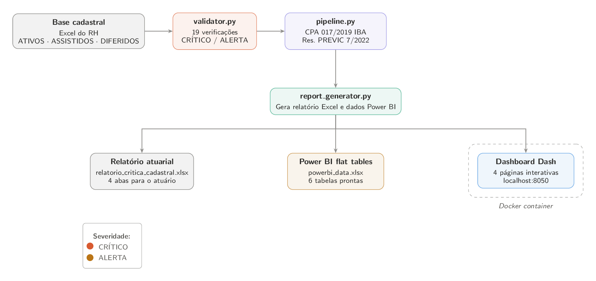

# Crítica da Base Cadastral — Avaliação Atuarial EFPC

Pipeline Python que valida e prepara dados cadastrais de participantes de fundos de pensão (EFPC) antes da avaliação atuarial anual, conforme exigências regulatórias da PREVIC.

> **Nota:** o `localhost:8050` mencionado abaixo é local — só você consegue acessar
> na sua máquina. Para outros acessarem é necessário rodar o Docker num servidor
> acessível na rede, ou usar deploy em nuvem.

---

## Por que esse projeto existe

A Resolução PREVIC nº 7/2022 (Art. 8) exige que toda EFPC archive seus dados cadastrais em planilha eletrônica antes de cada avaliação atuarial. O CPA 017/2019 do IBA define que **a crítica da base cadastral é o primeiro passo obrigatório de toda auditoria atuarial**:

> "O Atuário Independente deve verificar se as informações sobre os participantes e assistidos estão alinhadas com os registros internos e os dados utilizados pelo Atuário Responsável Técnico."

Na prática esse processo é feito manualmente em Excel. Este pipeline automatiza as verificações em ~2 segundos, gera o relatório atuarial formatado, exporta dados para Power BI e disponibiliza um dashboard interativo.

---

## Stack

| Camada | Tecnologia | Uso |
|---|---|---|
| Validação + relatório | Python · pandas · openpyxl | Pipeline CLI |
| Dashboard interativo | Plotly Dash 4 · Flask · gunicorn | 4 páginas dark theme |
| Deploy empresarial | Docker · docker-compose | Self-hosted, dados na rede interna |
| BI corporativo | Power BI Desktop | `powerbi_data.xlsx` pronto para importar |

---

## Screenshots

**Visão Geral** — KPIs de população, inconsistências por código e composição da base


**Inconsistências** — frequência por código e tabela completa com badges CRÍTICO/ALERTA


**Ativos** — distribuição etária, salarial, scatter idade × salário e breakdown por cargo


**Assistidos** — distribuição etária, de benefícios, por tipo e scatter idade × benefício


---

## Arquitetura do pipeline



---

## Início rápido

### Opção A — Python direto

```bash
python -m venv venv
venv\Scripts\activate        # Windows
pip install -r requirements.txt

# Rodar pipeline — gera os Excels em results/reports/
python src/pipeline.py --demo

# Rodar dashboard — abre em http://localhost:8050
python app/dashboard.py
```

### Opção B — Docker (deploy empresarial)

```bash
# Build e start (requer Docker Desktop instalado e rodando)
docker compose up -d

# Acessar em http://localhost:8050
# Na rede interna da empresa: http://IP-DO-SERVIDOR:8050

# Ver logs
docker compose logs -f

# Parar
docker compose down
```

> **Por que Docker para uso empresarial?**
> Dados de participantes de EFPC são protegidos pela LGPD. Com Docker self-hosted,
> nenhum dado sai da rede interna — o container roda no servidor da própria empresa.

---

## Saídas geradas

| Arquivo | Destinatário | Conteúdo |
|---|---|---|
| `results/reports/relatorio_critica_cadastral.xlsx` | Atuário responsável | 4 abas: sumário executivo, inconsistências, base limpa, análise por tipo |
| `results/reports/powerbi_data.xlsx` | Analista de BI | 6 tabelas flat prontas para Power BI Desktop |

---

## Dashboard (Plotly Dash 4)

4 páginas navegáveis pelo sidebar:

| Página | Conteúdo |
|---|---|
| **Visão Geral** | KPIs de população, gráfico de inconsistências por código, donut de composição |
| **Inconsistências** | Frequência por código + tabela completa com badges CRÍTICO/ALERTA |
| **Ativos** | Distribuição etária, salarial, scatter idade×salário, breakdown por cargo |
| **Assistidos** | Distribuição etária, de benefícios, por tipo, scatter idade×benefício |

---

## Power BI

Ver `powerbi/INSTRUCOES_POWER_BI.md` para passo a passo completo com:
- Conectar `powerbi_data.xlsx` no Power BI Desktop
- Criar relacionamentos entre as 6 tabelas
- Medidas DAX prontas (N Críticos, Razão Assistidos/Ativos, etc.)
- 4 páginas de dashboard sugeridas

---

## Por que Power BI point-and-click não é estado da arte

Este projeto exporta um `powerbi_data.xlsx` pronto para importação manual no Power BI Desktop. Vale ser honesto sobre o que isso significa tecnicamente: é uma concessão à realidade do mercado corporativo brasileiro atual, não uma escolha de engenharia ideal. A seção abaixo documenta por que ferramentas de BI puramente visuais têm limitações estruturais sérias, o que o ecossistema está fazendo para resolvê-las, e o caminho que este projeto seguirá quando as ferramentas amadurecerem.

### O problema do arquivo binário e da memória humana

Qualquer ferramenta de BI que exige que um humano arraste visuais, configure relacionamentos manualmente e salve um arquivo binário viola um princípio básico da engenharia de software: **reprodutibilidade**. Se o processo de criação de um artefato não pode ser descrito integralmente em código, ele não pode ser versionado, testado, revisado em pull request, auditado, ou reproduzido de forma idêntica por outra pessoa em outra máquina. O conhecimento existe na memória de quem clicou, não no repositório.

No contexto de uma EFPC isso tem consequências concretas.

**Versionamento inexistente.** Um arquivo `.pbix` é um ZIP binário. Executar `git diff` num `.pbix` não produz nenhuma informação útil — o Git trata o arquivo como um blob opaco. Não existe registro legível de quais medidas DAX foram alteradas entre a avaliação atuarial de dezembro e a de março, qual visual foi adicionado e por quê, ou quem mudou qual filtro. Em auditoria atuarial, onde rastreabilidade é um requisito regulatório explícito da Resolução PREVIC 7/2022, isso é uma falha estrutural.

**Irreprodutibildade sistêmica.** Se o analista que montou o relatório sair da empresa, a capacidade de reproduzir aquele dashboard vai junto. Não existe um script que descreva "execute esses comandos e você terá o mesmo resultado". Em contraste, este pipeline pode ser executado com `python src/pipeline.py --demo` por qualquer pessoa em qualquer máquina e produzirá outputs idênticos — essa é a definição de reprodutibilidade.

**Integração contínua impossível.** Ferramentas de BI visuais não se integram a pipelines de CI/CD. Não existe um comando `powerbi build --validate` que roda no GitHub Actions para garantir que o relatório está consistente com os dados antes de cada deploy. Toda mudança nos dados, seja um novo campo no cadastro ou uma nova situação regulatória adicionada pela PREVIC, exige intervenção manual no relatório.

**Colaboração travada.** Dois analistas não conseguem trabalhar simultaneamente no mesmo `.pbix` sem sobrescrever o trabalho um do outro. A solução usual nas empresas ("fulano trabalha enquanto cicrano não mexe") é o equivalente a desenvolver software sem controle de versão. Qualquer equipe de engenharia de software rejeitaria esse fluxo imediatamente.

**Acoplamento a licença e sistema operacional.** O `.pbix` só abre no Power BI Desktop, que só roda em Windows, que exige conta Microsoft ativa. O Dash deste projeto roda em qualquer sistema operacional, em qualquer browser, sem licença, com `python app/dashboard.py`.

### O que o mercado está construindo para resolver isso

A Microsoft reconheceu esses problemas. O estado da arte em 2026 envolve três tecnologias que juntas movem o Power BI de ferramenta visual para infraestrutura de código.

**PBIR (Power BI Enhanced Report Format)** decompõe o arquivo monolítico `.pbix` em uma estrutura de pastas com arquivos JSON individuais para cada página, visual, bookmark e interação. Cada arquivo tem um schema JSON público documentado pela Microsoft. Tornou-se o formato padrão do Power BI Service em janeiro de 2026 e do Power BI Desktop em março de 2026. Pela primeira vez é possível fazer `git diff` num relatório Power BI e ver exatamente qual propriedade de qual visual mudou. Fonte: [Microsoft Learn, Power BI Enhanced Report Format](https://learn.microsoft.com/en-us/power-bi/developer/embedded/projects-enhanced-report-format).

**PBIP (Power BI Project)** organiza o PBIR e o TMDL (modelo semântico como texto) em uma estrutura de diretórios versionável com Git. Um relatório Power BI passa a ser um repositório como qualquer outro projeto de software, com histórico de commits, branches e pull requests. Fonte: [Microsoft Learn, Power BI Desktop Projects](https://learn.microsoft.com/en-us/power-bi/developer/projects/projects-overview).

**`powerbpy`** é uma biblioteca Python open-source que gera a estrutura PBIP/PBIR inteiramente por código, sem abrir o Power BI Desktop. O resultado pode ser aberto e editado normalmente no Desktop, e versionado no Git como qualquer arquivo de texto. Fonte: [powerbpy no PyPI](https://pypi.org/project/powerbpy/).

### Por que este projeto ainda não usa essas ferramentas

O PBIR ainda está em preview. A Microsoft adverte que a especificação pode mudar antes do GA previsto para Q3 2026, e o `powerbpy` é um projeto de desenvolvedor independente cujo roadmap depende da estabilidade do PBIR. Construir um pipeline de produção sobre especificação em preview seria trocar um problema (relatório não reprodutível) por outro (código que quebra quando a Microsoft muda a spec antes do GA).

Exportar `powerbi_data.xlsx` bem estruturado para importação manual é a decisão pragmaticamente correta para o momento: satisfaz o requisito real dos analistas de EFPC que precisam de Power BI hoje, sem amarrar o projeto a tecnologia instável.

### O que este projeto fará quando o PBIR atingir GA

Assim que o PBIR sair de preview (previsão Q3 2026), o projeto será atualizado com um gerador programático:

```
src/
└── powerbi_generator.py   -- gera estrutura PBIP/PBIR por Python
                              sem abrir o Power BI Desktop
                              usando powerbpy + edição direta dos JSON PBIR

powerbi/
├── INSTRUCOES_POWER_BI.md  -- mantido para quem preferir o fluxo manual
└── report/                 -- gerado automaticamente pelo script
    ├── definition.pbir
    ├── pages/
    └── visuals/
```

O pipeline passará a ser completamente reprodutível de ponta a ponta:

```bash
python src/pipeline.py --demo       # valida dados, gera Excels
python src/powerbi_generator.py     # gera relatório Power BI por código
```

---

## Validações implementadas (19 verificações)

| Código | Severidade | Verificação | Impacto Atuarial |
|---|---|---|---|
| C001 | CRÍTICO | Campo obrigatório ausente | Impede cálculo de PMBaC/PMBC |
| C002 | CRÍTICO | Data de nascimento no futuro | Impossível logicamente |
| C003 | CRÍTICO | Ativo com menos de 16 anos | CLT Art. 403 |
| C004 | CRÍTICO | Admissão ao plano após data-base | Não deveria constar na avaliação |
| C005 | CRÍTICO | Admissão anterior ao nascimento | Tempo de serviço e PMBaC incorretos |
| C006 | CRÍTICO | Salário abaixo do SMN 2024 (R$ 1.412) | No método PUC, propaga para todo o benefício projetado |
| C007 | CRÍTICO | Código de sexo inválido | Tábua biométrica errada — ä₆₅ muda ±16% |
| C008 | CRÍTICO | Situação não reconhecida pela PREVIC | Grupo de custeio incorreto |
| C009 | CRÍTICO | CPF duplicado | PMBaC calculada em duplicidade — passivo inflado |
| C010 | CRÍTICO | Campo obrigatório ausente em assistido | Impede cálculo da PMBC |
| C011 | CRÍTICO | Benefício nulo ou negativo | PMBC = 0 → passivo subestimado, risco de falso superávit |
| C012 | CRÍTICO | Saldo de conta nulo em diferido | Reserva de BPD incorreta |
| A001 | ALERTA | Ativo com mais de 75 anos | Confirmar permanência em atividade |
| A002 | ALERTA | Admissão quando tinha < 16 anos | Verificar com RH |
| A003 | ALERTA | Salário acima de R$ 100.000 | Confirmar com RH |
| A004 | ALERTA | Benefício abaixo do SMN | Verificar se correto |
| A005 | ALERTA | Benefício acima de R$ 80.000 | Confirmar com cadastro |
| A006 | ALERTA | Aposentadoria programada antes dos 55 anos | Pode ser invalidez lançada com tipo errado |
| A007 | ALERTA | Diferido acima de 70 anos sem benefício | Verificar se está vivo e foi notificado |

---

## Resultados (base demo — 930 participantes)

| Métrica | Valor |
|---|---|
| Inconsistências críticas | 63 |
| Inconsistências alertas | 26 |
| Razão assistidos/ativos | 0.417 (fundo maduro) |
| Massa salarial mensal | R$ 14.7M |
| Total benefícios/mês | R$ 3.2M |
| Tempo de execução | ~2s |

---

## Estrutura do projeto

```
cadastral-actuarial-pipeline/
│
├── Dockerfile                    ← imagem Docker para deploy empresarial
├── docker-compose.yml            ← sobe tudo com 1 comando
├── requirements.txt
├── README.md
│
├── src/
│   ├── pipeline.py               ← entry point CLI
│   ├── generate_data.py          ← gerador de base demo (930 participantes)
│   ├── validator.py              ← 19 verificações regulatórias
│   └── report_generator.py      ← Excel atuarial + Power BI flat tables
│
├── app/
│   ├── dashboard.py              ← Plotly Dash 4 (4 páginas, dark theme)
│   └── assets/style.css
│
├── powerbi/
│   └── INSTRUCOES_POWER_BI.md
│
└── data/
    ├── raw/                      ← base recebida do RH (.xlsx)
    └── processed/
```

---

## Referências regulatórias

- **Resolução PREVIC nº 7/2022, Art. 8** — dados cadastrais em planilha eletrônica
- **Resolução PREVIC nº 23/2023** — norma consolidada EFPC
- **CPA 017/2019 IBA** — Auditoria Atuarial: crítica cadastral é o primeiro passo
- **CPAO 035 IBA** — Reservas Matemáticas (PMBaC, PMBC, método PUC)
- **CLT Art. 403** — idade mínima de trabalho (16 anos)

---

## Autor

Arthur Motta — Ciências Atuariais e Estatística, UFRJ
[GitHub](https://github.com/arthurpmotta02) · [LinkedIn](https://linkedin.com/in/arthurpmotta)